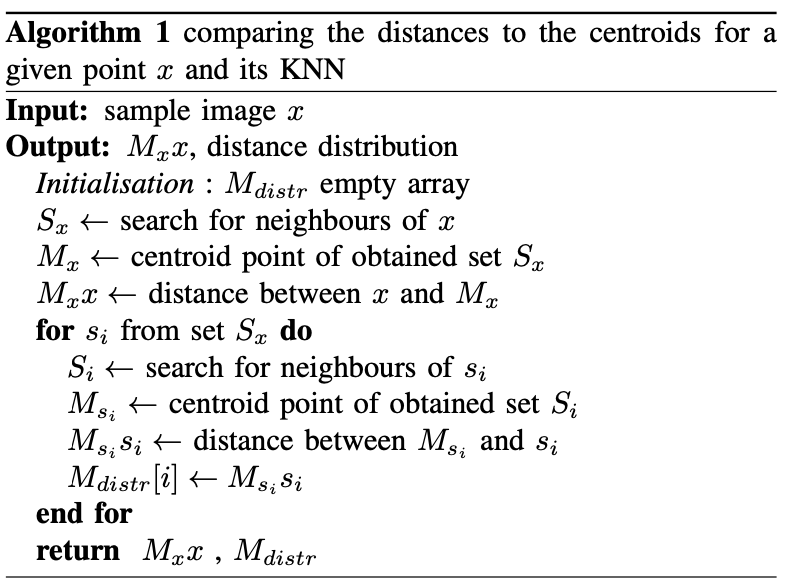

# Geometric properties of adversarial images

**Bogdan Ivanyuk-Skulskiy (NaUKMA), Galyna Kriukova (NaUKMA), Andrii Dmytryshyn (Örebro University)**

**Paper:** [https://ieeexplore.ieee.org/abstract/document/9204251](https://ieeexplore.ieee.org/abstract/document/9204251)

**DSMP 2020**

## News
+ [August 2020] The paper is accepted at **DSMP conference** with oral presentation.
+ [July 2020]  The paper is accepted at **EEML Summer School 2020** with oral presentation.

## Abstract
Machine learning models are now widely used in a variety of tasks. However, they are vulnerable to adversarial perturbations. These are slight, intentionally worst-case, modifications to input that change the model’s prediction with high confidence, without causing a human eye to spot a difference from real samples. The detection of adversarial samples is an open problem. In this work, we explore a novel method towards adversarial image detection with a linear algebra approach. This method is built on a comparison of distances to the centroids for a given point and its neighbors. The method of adversarial examples detection is explained theoretically, and numerical experiments are done to illustrate the approach.

## About the paper

Many learning algorithms exploit the idea that data concentrates around a low dimensional manifold. In the following method, we use geometrical characteristics of such a manifold for detecting adversarial examples.

We make the following assumptions on our data: <br>
&nbsp;&nbsp;&nbsp; (a) Data points belong to a smooth manifold<br>
&nbsp;&nbsp;&nbsp; (b) For every point on this manifold (data point or not), the centroid of its  nearest neighbors (KNN) is approximately at the same distance from this point<br>
&nbsp;&nbsp;&nbsp; (c) For a point that does not belong to the manifold the set of its KNN coincides with the set of KNN of its projection on the manifold


Let  be a point outside of a given manifold, and  be the centroid of its  nearest neighbors. For the Euclidean distance we have 

<p align="center">
   
</p>

where  is the projection of  on the manifold.

From our assumption (c) we have that if  is a centroid for KNN of  then  is also a centroid for KNN of . Combining this with the assumption (b) we have that , for any points  and its KNN's centroid . Therefore .

Now since X is outside of our manifold we have  0"> and thus  M^{'}_{x^{'}} x^{'} ">. Moreover,

<p align="center">
   
</p>

Therefore we may use the following statement as a criterion if a given example is adversarial of not:

***For every point outside of a given (differential) manifold and large enough integer k, the distance to the centroid of its k nearest neighbors is significantly larger than the distance from a point on this manifold to the centroid of its k nearest neighbors***

The above theory results in the following method described in Algorithm 1.

<p align="center"></p>

## Code
To test the algorithm on other data first train the autoencoder model and save model architecture in `models/autoencoder.py` and model weights in `data/model_weights/` folder. 

Afterwards run the following code:

`python run_experiment.py --data_path_real=data/train_data/real_data --data_path_generated=data/train_data/adv_data --autoencoder_weights_path=data/model_weights/my_autoencoder_full.pth --number_of_samples=1000`


### Citation
```
@INPROCEEDINGS{9204251,
  author={B. {Ivanyuk-Skulskiy} and G. {Kriukova} and A. {Dmytryshyn}},
  booktitle={2020 IEEE Third International Conference on Data Stream Mining   Processing (DSMP)}, 
  title={Geometric Properties of Adversarial Images}, 
  year={2020}
  }
```
